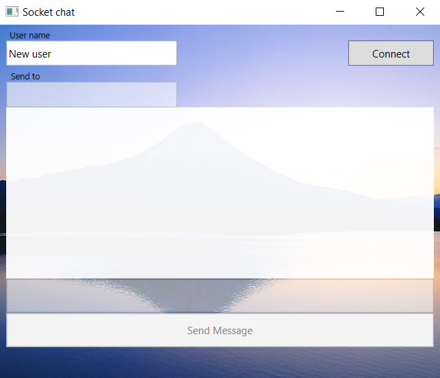

# TeleMessage

The Windows TeleMessage app written in [C#](https://docs.microsoft.com/en-us/dotnet/csharp) [WPF](https://docs.microsoft.com/en-us/dotnet/desktop/wpf/overview) and implemented using a client server [MVVM](https://docs.microsoft.com/en-us/windows/uwp/data-binding/data-binding-and-mvvm) architecture. The app provides console or desktop chat over a local network using [WebSockets](https://docs.microsoft.com/en-us/dotnet/api/system.net.websockets).

## Technology stack

* [.NET 5.0](https://dotnet.microsoft.com/en-us/download/dotnet/5.0)
* [ASP.NET Core 5.0](https://dotnet.microsoft.com/en-us/download/dotnet/5.0)
* [Newtonsoft.JSON](https://www.nuget.org/packages/Newtonsoft.Json/)
* [Prism](https://www.nuget.org/packages/Prism.Core/)

## Getting started

To start using the app, you need to:

1. Open [src\Chat.sln](https://github.com/Donat-Kolzenov/TeleMessage/blob/master/src/Chat.sln) in Visual Studio to build the TeleMessage app
2. Launch the Server (Chat.Server.exe)
3. Launch the Client (Chat.DesktopClient.exe / Chat.ConsoleClient.exe)
